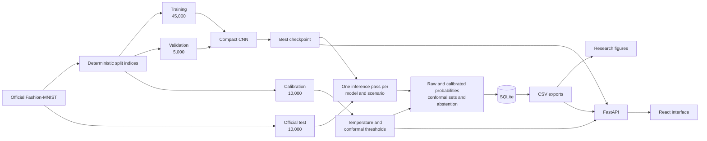
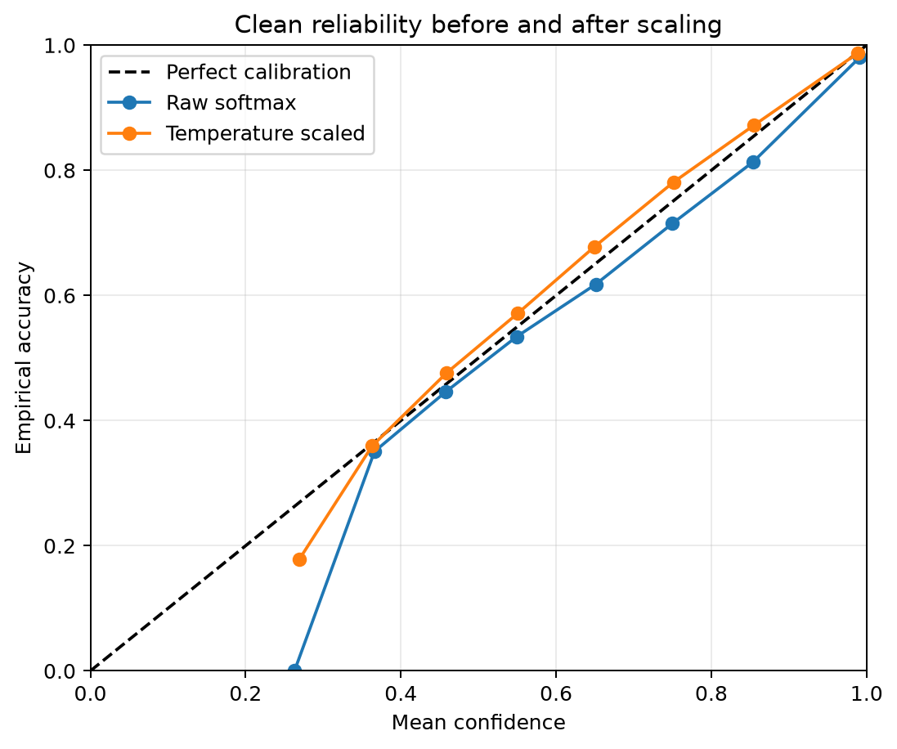
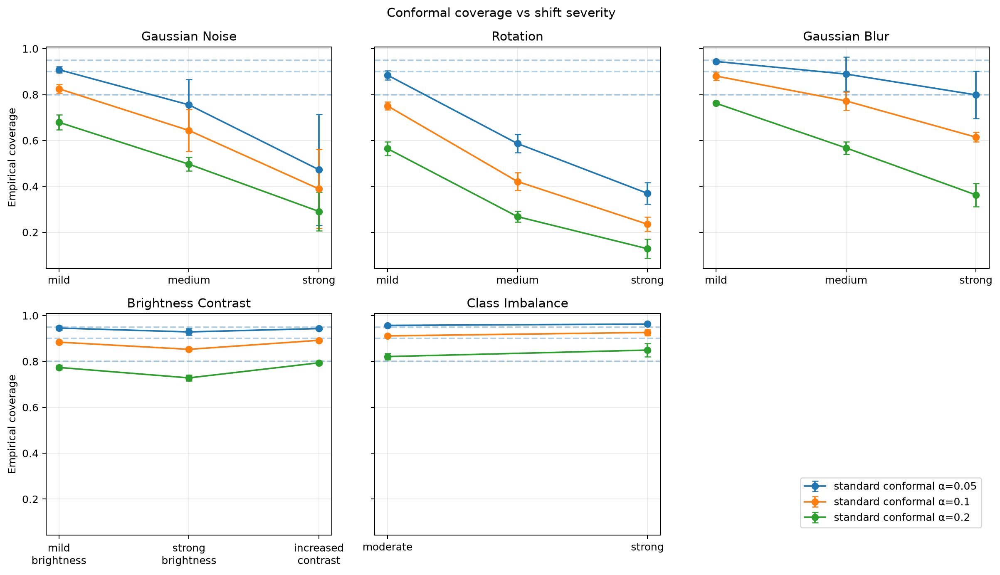
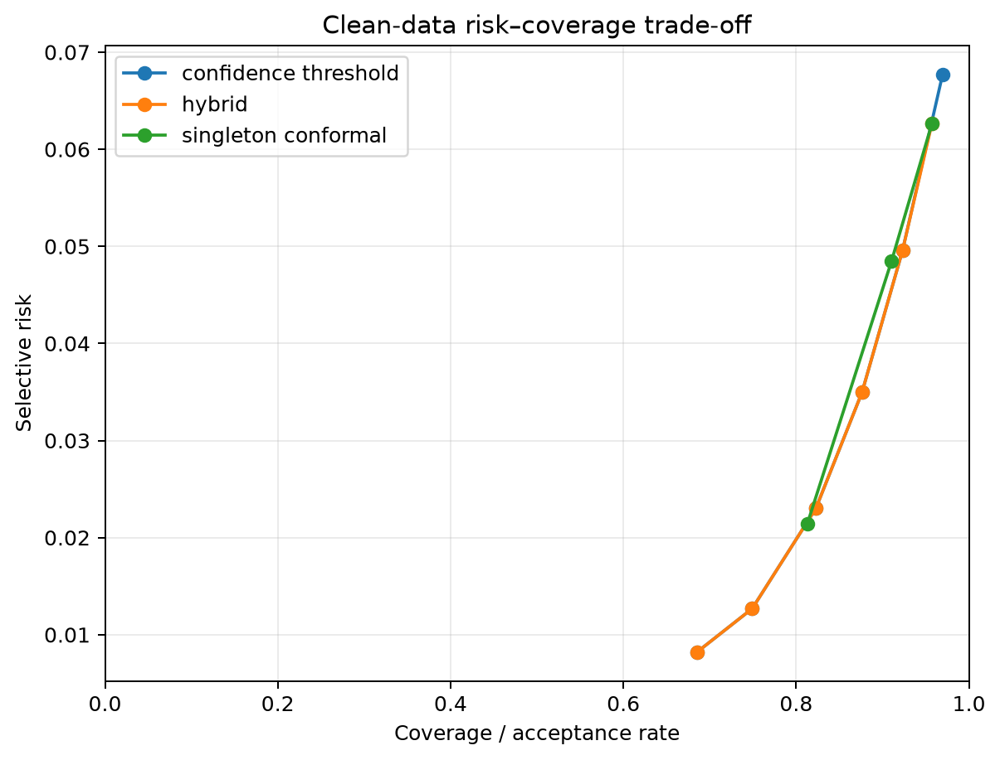

<div align="center">

# ClothSense

**A local research prototype for evaluating classification uncertainty under image-distribution shift.**


[Research Report](research_report.md) · [Configuration](configs/default.yaml) · [Saved Results](results/)

</div>

---

**[Overview](#overview) · [Methodology](#experimental-methodology) · [Results](#verified-results) · [Architecture](#system-architecture) · [Reproducibility](#reproduce-the-research-pipeline) · [Limitations](#limitations)**

## Overview

ClothSense studies whether uncertainty estimates from an image classifier remain reliable when evaluation data differ from the training distribution. A compact convolutional neural network classifies the ten Fashion-MNIST categories; the same saved logits are then evaluated with raw softmax confidence, temperature scaling, standard and class-conditional split conformal prediction, and three abstention policies.

The central research question is:

> How do classification accuracy, calibration, conformal coverage, and selective risk change as Fashion-MNIST inputs undergo controlled distribution shifts?

The project includes the complete experimental pipeline, persisted results, a local inference API, and a React interface. It is not intended as a general-purpose clothing recognizer or an out-of-distribution detector.

## What the project implements

- Deterministic, stratified Fashion-MNIST train/validation/calibration splits with saved indices.
- Three independently initialized CNN runs using seeds 17, 42, and 73.
- Best-checkpoint selection by validation loss with early stopping.
- Calibration-only fitting of one scalar temperature and conformal thresholds per model.
- Standard and class-conditional split conformal prediction at alpha 0.05, 0.10, and 0.20.
- Confidence-threshold, singleton-set, and hybrid abstention policies.
- Fourteen controlled shifted-test scenarios plus the clean test scenario.
- Classification, calibration, conformal, selective-prediction, and runtime metrics.
- SQLite run metadata and five tidy CSV result exports.
- Student-t 95% confidence intervals across the three seeds.
- Ten static research figures generated from persisted CSV files.
- Deterministic JPG/JPEG/PNG preprocessing and artifact-backed inference.
- A minimal FastAPI service and four-page React/Vite research interface.

## System architecture



The mathematical components are independent of persistence and presentation. FastAPI delegates preprocessing and prediction to `InferenceService`; React consumes the API and never trains, calibrates, or recomputes experiment metrics.

## Technology stack

| Layer                  | Implementation                                  |
| ---------------------- | ----------------------------------------------- |
| Model and data         | Python 3.11+, PyTorch, torchvision, NumPy       |
| Metrics and statistics | scikit-learn, pandas, SciPy                     |
| Images and figures     | Pillow, Matplotlib, Seaborn                     |
| Configuration          | YAML loaded into Python dataclasses             |
| Persistence            | SQLite and CSV                                  |
| Local API              | FastAPI, Uvicorn, Pydantic schemas              |
| Interface              | React 19, React Router, Vite, CSS, Lucide icons |
| Tests                  | pytest and FastAPI TestClient                   |

## Experimental methodology

### Dataset separation

The official 60,000-image Fashion-MNIST training set is partitioned using split seed 2027. Saved indices are validated before reuse.

| Role        | Samples | Permitted use                                           |
| ----------- | ------: | ------------------------------------------------------- |
| Training    |  45,000 | Gradient updates only                                   |
| Validation  |   5,000 | Early stopping and checkpoint selection                 |
| Calibration |  10,000 | Temperature and conformal fitting only                  |
| Clean test  |  10,000 | Final clean evaluation and source for shifted scenarios |

All splits are stratified by class. The official test set is never included in the saved training-set partition. Normalization is computed from the 45,000-image training split only: mean `0.28602888`, standard deviation `0.35298434`. No training augmentation is configured.

### Model and training

The fixed model is:

```text
Conv2d(1, 32, 3x3, padding=1) -> ReLU -> MaxPool2d(2)
Conv2d(32, 64, 3x3, padding=1) -> ReLU -> MaxPool2d(2)
Flatten -> Linear(3136, 128) -> ReLU -> Dropout(0.50) -> Linear(128, 10)
```

Training uses cross-entropy loss, Adam with learning rate 0.001, batch size 128, at most 20 epochs, and patience 3. Validation loss is the sole checkpoint-selection metric. The selected upload model is seed 73 because it had the lowest validation loss (`0.2096`) among the three runs, not because of test performance.

### Uncertainty methods

- **Raw softmax:** uncalibrated ten-class probabilities and maximum probability.
- **Temperature scaling:** one strictly positive scalar fitted by calibration-set negative log-likelihood; dividing all logits by the scalar preserves the argmax.
- **Standard split conformal:** nonconformity score `1 - p(y|x)` and the finite-sample rank `ceil((n + 1)(1 - alpha))`.
- **Class-conditional conformal:** a separate threshold for each true calibration class; candidate class `k` uses class `k`'s threshold.
- **Abstention:** calibrated-confidence, singleton conformal-set, and hybrid singleton-plus-confidence rules.

The upload demonstration is configured at alpha `0.10` with the hybrid policy and confidence threshold `0.80`.

### Distribution shifts

All image corruptions operate in raw `[0,1]` pixel space, preserve the 28×28 shape and original label, and are normalized afterward.

| Family              | Configured scenarios                                                    |
| ------------------- | ----------------------------------------------------------------------- |
| Gaussian noise      | standard deviation 0.10, 0.20, 0.30                                     |
| Rotation            | 10°, 20°, 30°                                                           |
| Gaussian blur       | sigma 0.5, 1.0, 1.5                                                     |
| Brightness/contrast | brightness 0.80; brightness 0.60; contrast 1.50                         |
| Class imbalance     | classes 0, 1, 8, and 9 retained; other classes retained at 0.50 or 0.20 |

Together with the clean scenario, this produces 15 scenarios per model seed. The saved SQLite database contains 45 seed-specific scenarios, 1,575 completed runs, and 25,845 scalar metric records.

## Verified results

All values below were read from `results/aggregate_metrics.csv` and are means over seeds 17, 42, and 73. The CSV also contains the sample standard deviation and Student-t 95% confidence interval for every complete group.

### Clean test

| Quantity                                               |                        Result |
| ------------------------------------------------------ | ----------------------------: |
| Accuracy                                               | 0.9173 (95% CI 0.9066–0.9279) |
| Raw ECE                                                |                        0.0159 |
| Temperature-scaled ECE                                 |                        0.0076 |
| Raw negative log-likelihood                            |                        0.2426 |
| Temperature-scaled negative log-likelihood             |                        0.2329 |
| Standard conformal coverage, alpha 0.10                |                        0.8971 |
| Standard worst-class coverage, alpha 0.10              |                        0.6627 |
| Class-conditional worst-class coverage, alpha 0.10     |                        0.8777 |
| Standard / class-conditional mean set size, alpha 0.10 |               0.9570 / 1.0123 |
| Hybrid-policy acceptance / selective risk              |               0.8228 / 0.0230 |

Temperature scaling changed confidence quality without changing predicted classes. At alpha 0.10, class-conditional calibration improved clean worst-class coverage, with a modest increase in average prediction-set size.

### Strongest configured shifts

The conformal columns use standard conformal prediction at alpha 0.10.

| Scenario                 | Accuracy | Calibrated ECE | Coverage | Mean set size |
| ------------------------ | -------: | -------------: | -------: | ------------: |
| Gaussian noise, std 0.30 |   0.4262 |         0.3702 |   0.3889 |         0.870 |
| Rotation, 30°            |   0.3270 |         0.2891 |   0.2351 |         0.580 |
| Gaussian blur, sigma 1.5 |   0.7548 |         0.0795 |   0.6145 |         0.700 |
| Brightness, factor 0.60  |   0.8890 |         0.0106 |   0.8528 |         0.924 |
| Strong class imbalance   |   0.9407 |         0.0093 |   0.9263 |         0.968 |

The class-imbalance accuracy increase reflects the changed class mixture and should not be interpreted as improved model quality. Strong noise and rotation show the central failure mode: accuracy, calibration, and conformal coverage can all deteriorate after distribution shift.







These figures are generated from the saved CSVs with `python -m scripts.generate_plots`; experiment metrics are not recomputed by the plotting code.

## Repository structure

```text
clothsense/                 Core data, model, uncertainty, shift, metric, storage,
                            experiment, reporting, inference, and API modules
configs/default.yaml        Seeds, paths, model/training values, shifts, uncertainty,
                            normalization, device, and upload settings
scripts/                    Data preparation, training, evaluation, experiment,
                            export, plotting, summary, smoke, and inference commands
tests/                      Focused unit and integration tests
frontend/                   React/Vite interface and API client
data/                       Fashion-MNIST files, saved splits, optional personal photos
artifacts/models/           Per-seed checkpoints, histories, logits, and uncertainty files
artifacts/plots/            Per-seed diagnostics and generated research figures
artifacts/processed_examples/ Optional qualitative processed-image outputs
results/                    SQLite database, five CSV exports, baselines, and summary
research_report.md          Concise interpretation of the completed experiments
```

Important result files are:

- `results/run_metrics.csv`: one row per run-level scalar metric.
- `results/aggregate_metrics.csv`: mean, sample standard deviation, and Student-t 95% confidence interval.
- `results/per_class_metrics.csv`: per-class classification and conformal metrics.
- `results/reliability_bins.csv`: fixed-bin confidence and empirical-accuracy data.
- `results/risk_coverage.csv`: acceptance and selective-risk points.
- `results/clothsense.sqlite`: models, scenarios, runs, statuses, and scalar metrics.
